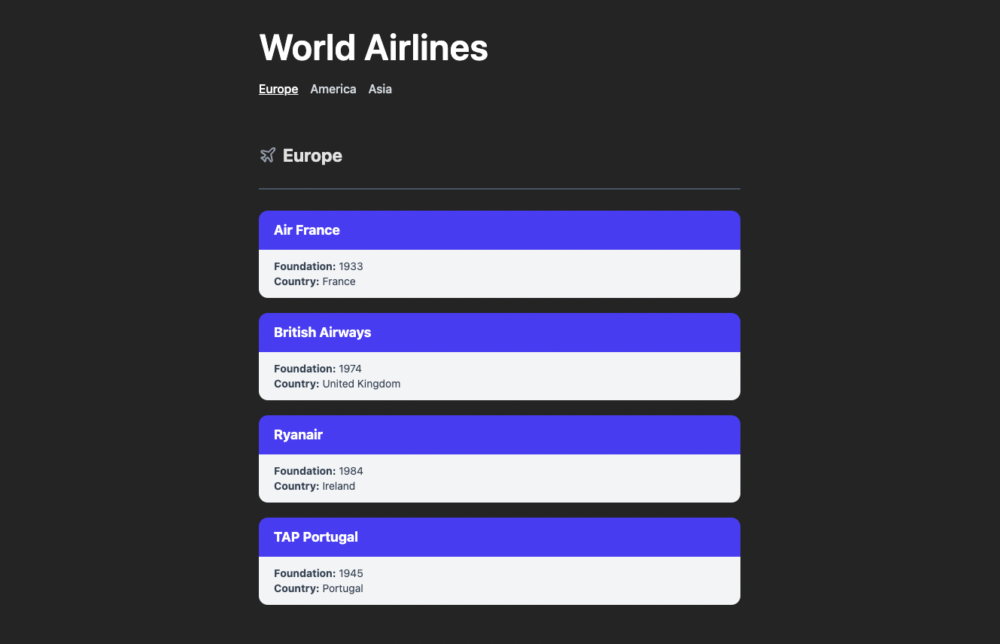

# Advanced Redux Toolkit techniques to handle large applications

This project uses React + Vite + Redux Toolkit + Node Express among other dependencies.

Read more about this project in this article called [Redux Toolkit Advanced: Scaling Redux Toolkit for Large Applications](https://dionarodrigues.dev/blog/redux-toolkit-advanced-scaling-for-large-applications).



## 🚀 Getting Started

Assuming [Node.js](https://nodejs.org/en/) is installed, run the following commands to install the project:

```
yarn install
yarn dev
```

Then start the Server to be able to retrive the enpoints:

```
cd server
node server.js
```
