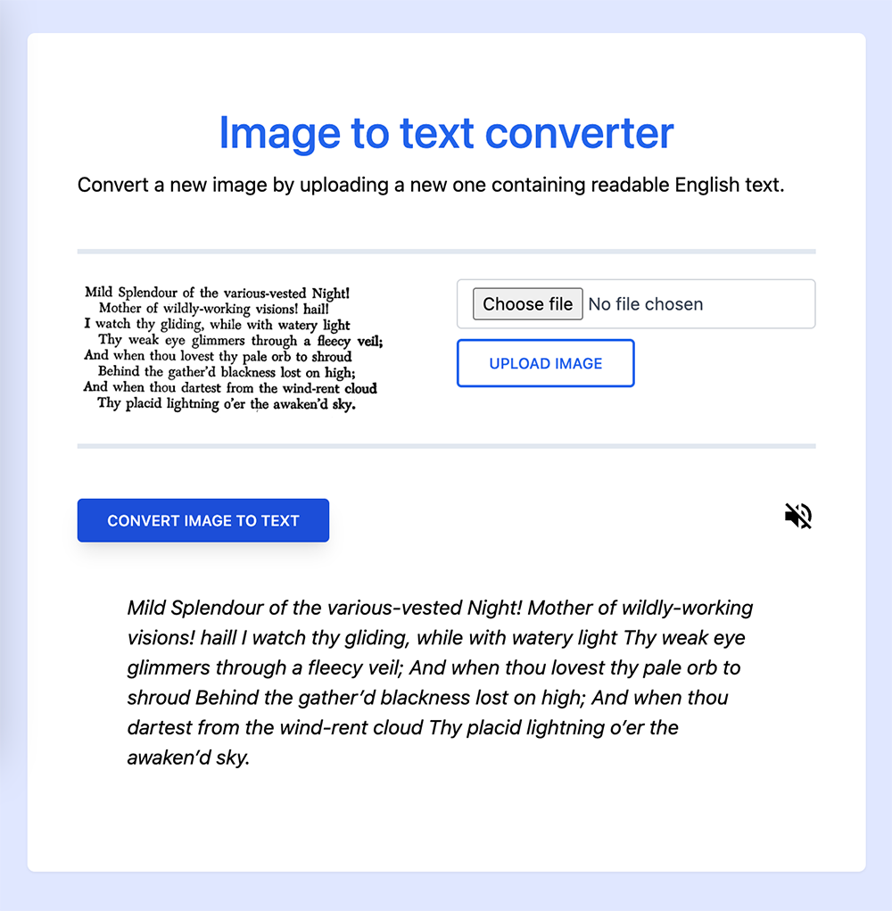

# Image to text converter with JavaScript

[Demo on Codepen](https://codepen.io/diogorodrigues/pen/KKZyVVW)

---

**A simple image to text converter using modern Javascript APIs and [Tailwind CSS](https://tailwindcss.com/)**

- [Tesseract.js](https://tesseract.projectnaptha.com/)
- [FileReader](https://developer.mozilla.org/en-US/docs/Web/API/FileReader)
- [Speech Synthesis Utterance](https://developer.mozilla.org/en-US/docs/Web/API/SpeechSynthesisUtterance)
- [Tailwind CSS](https://tailwindcss.com/)
