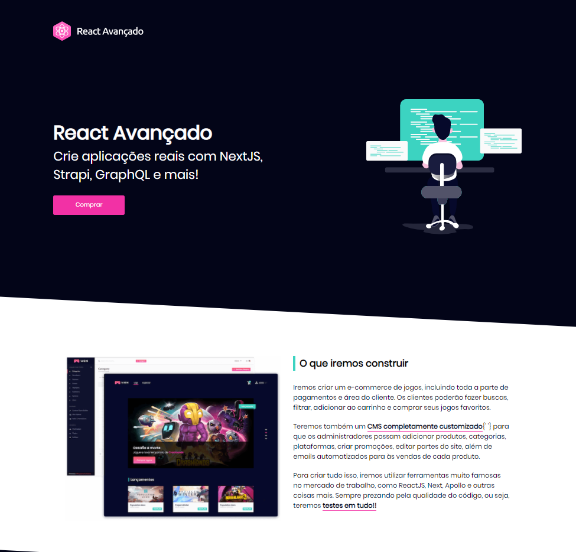
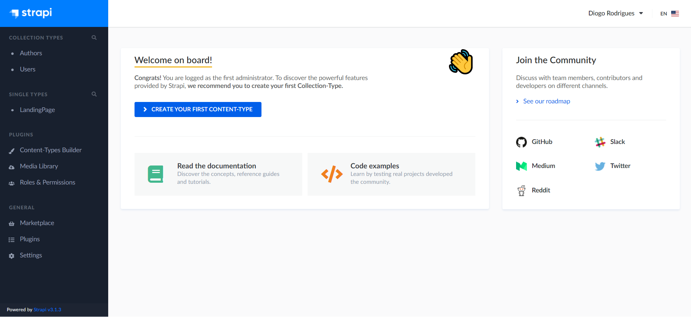

# Landing Page with Strapi Headless CMS and Next.js

[Live demo of the landing page on Netlify](https://nextjs-netlify-test.netlify.app/). 👌😎

[Live demo of the Strapi on Heroku](https://strapi-heroku-test-ladodesign.herokuapp.com/admin/). 👌😎

These demos were built on this [portuguese course](https://reactavancado.com.br/) that I took.

__[Strapi](https://strapi.io/) is the leading open-source headless CMS. It’s 100% Javascript, fully customizable and developer-first.__

Using Strapi is really super easy, since it's built on top of React. With just only one [command with yarn/npx](https://strapi.io/documentation/v3.x/installation/cli.html#step-2-create-a-new-project) we can start a new project using this amazing headless CMS (we access its content using an API and it doesn't care about how and where its content gets displayed).~

__[Next.js](https://strapi.io/) gives you the best developer experience with all the features you need for production: hybrid static & server rendering, TypeScript support, smart bundling, route pre-fetching, and more. No config needed.__

[Strapi documentation](https://strapi.io/documentation/v3.x/getting-started/quick-start.html) 
[Next.js documentation](https://nextjs.org/docs/getting-started) 
