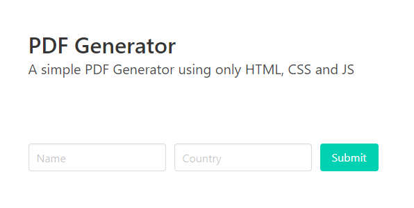

# ✔ PDF Generator with HTML and JS 

[Demo on Codepen](https://codepen.io/diogorodrigues/pen/zYrjyme)

---

**PDF Generator using [jsPDF](https://github.com/mrrio/jspdf), a is a library to generate PDFs in client-side JavaScript.**
