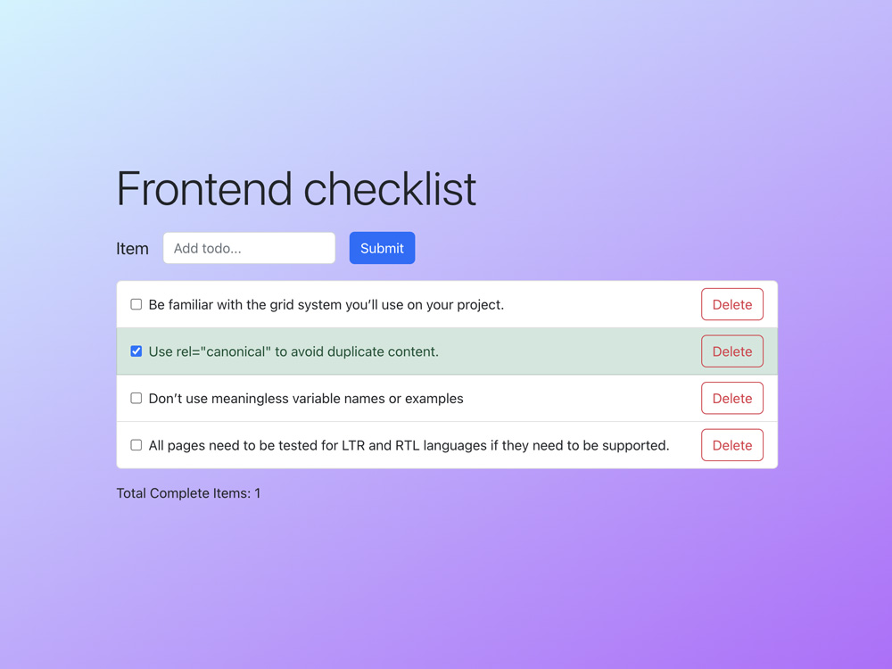

# Todo List with React, Redux and Node.js

---

**A simply Todo List with React, Redux and Node.js**

There are two directories in this project:

- `api`: the back-end using [Node.js](https://nodejs.org/)
- `app`: the application built on [React](https://reactjs.org/) using [Redux](https://redux.js.org/) and [Bootstrap](https://getbootstrap.com/).

---

👌
