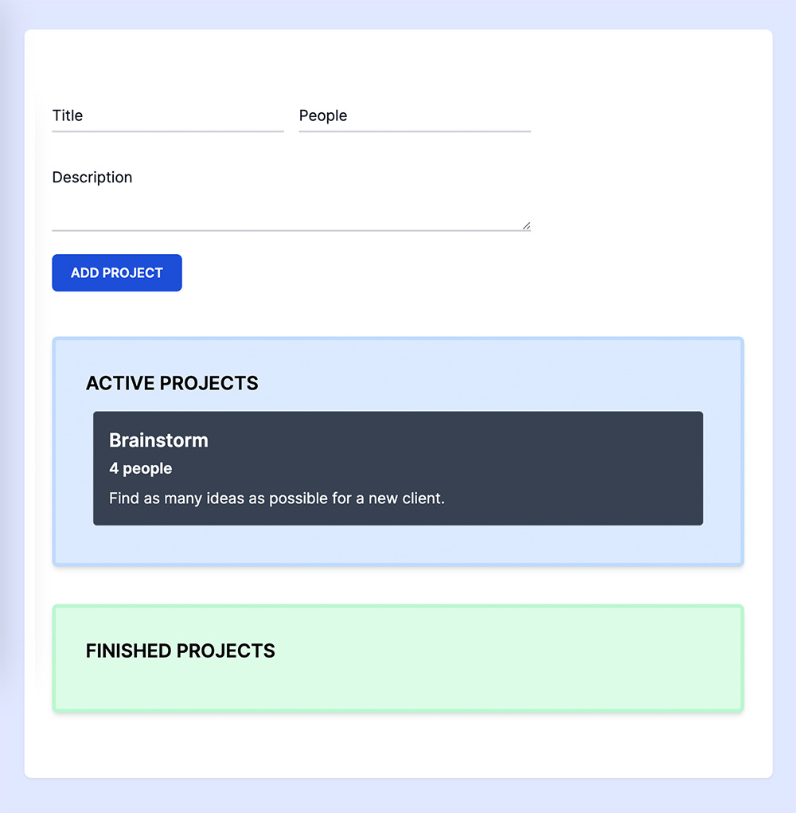

# Drag and Drop with Typescript

---

**A Typescript experiment using Class, [Decorators](https://www.typescriptlang.org/docs/handbook/decorators.html), [Generics](https://www.typescriptlang.org/docs/handbook/2/generics.html) and more to build a simple system to add projects via form. It also contains drag and drop functionality to move projects between Active and Finished areas.**

- [Typescript](https://www.typescriptlang.org/)
- [Drag and Drop HTML API](https://developer.mozilla.org/en-US/docs/Web/API/HTML_Drag_and_Drop_API)
- [Tailwind CSS](https://tailwindcss.com/)
- [Webpack](https://webpack.js.org/)

## Commands

- `dev`: runs your application on `localhost:3000`
- `build`: creates the production build version
- `server`: starts a simple server with the build production code
- `css`: generates all CSS code
- `test`: runs jest to test all components and pages

---

If you don't know or still not use Typescript in your projects, please take a look at [Why you should use Typescript now](https://www.diogorodrigues.dev/blog/why-you-should-use-typescript-now)
