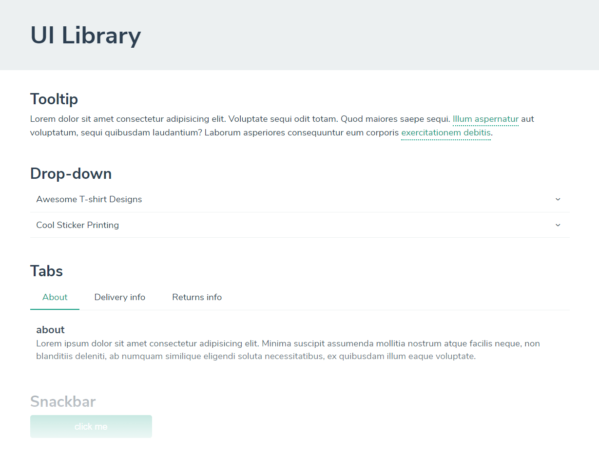

# Simple UI Library using webpack



A simple UI Library using [Webpack](https://webpack.js.org/) and [Babel](https://babeljs.io/). 

## Getting Started

### Dependencies
Make sure [Node.js](https://nodejs.org/en/) is installed.

### Quick Start
Then you need to install the dependencies to run this boilerplate:

```sh
$ yarn       # or 'npm install'
```

## File Structure

```sh
ui-library

├── dist
│   ├── assets
│   │   ├── bundle.js
│   ├── index.html
├── src
│   ├── ui-library/
│   │   ├── styles/*.css
│   │   ├── components files
│   └── index.js
├── package.json
├── .webpack.config.js
├── README.md
```

## Tasks

### Main Tasks

- `yarn serve` - start and watch a server with hot reload
- `yarn build` - build the application