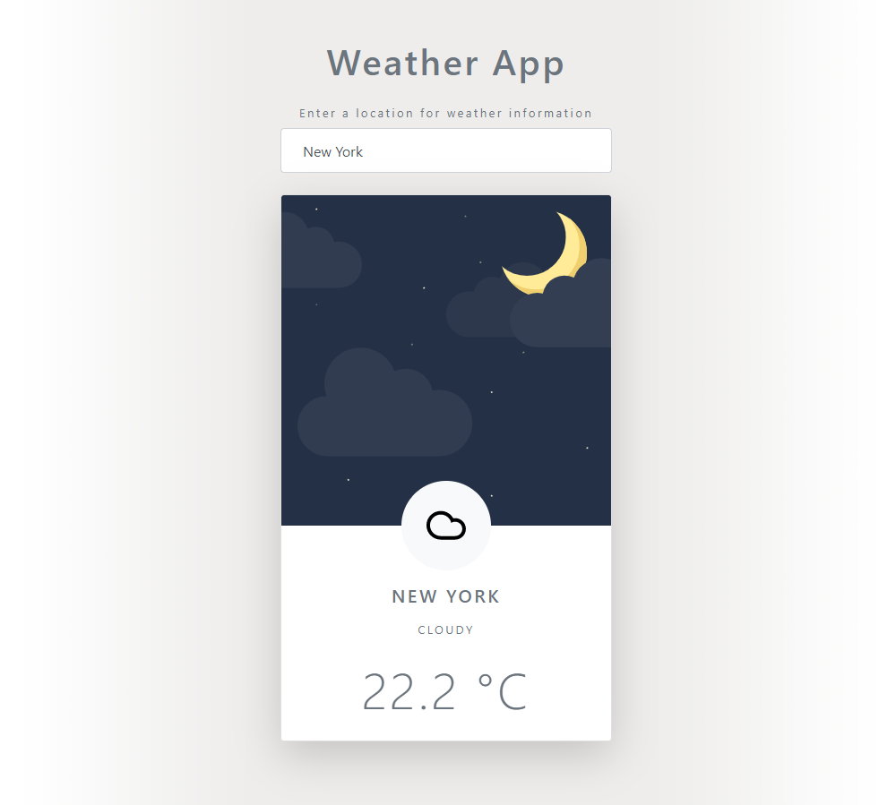

# 🌞🌚🌈 Weather App with JavaScript and HTML

[Demo on Codepen](https://codepen.io/diogorodrigues/pen/qBboqdq)

---

**A simple weather app using a few lines of Javascript on top of Bootstrap HTML/CSS**

When entering a city name, this app obtains info from the [AccuWeather API](https://developer.accuweather.com/) and displays some details about the weather at that time by using `fetch API` and some other great ES6 features, like Class, Local Storage and Template Literals (template strings) for example.  

